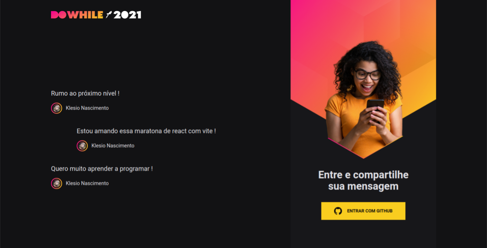
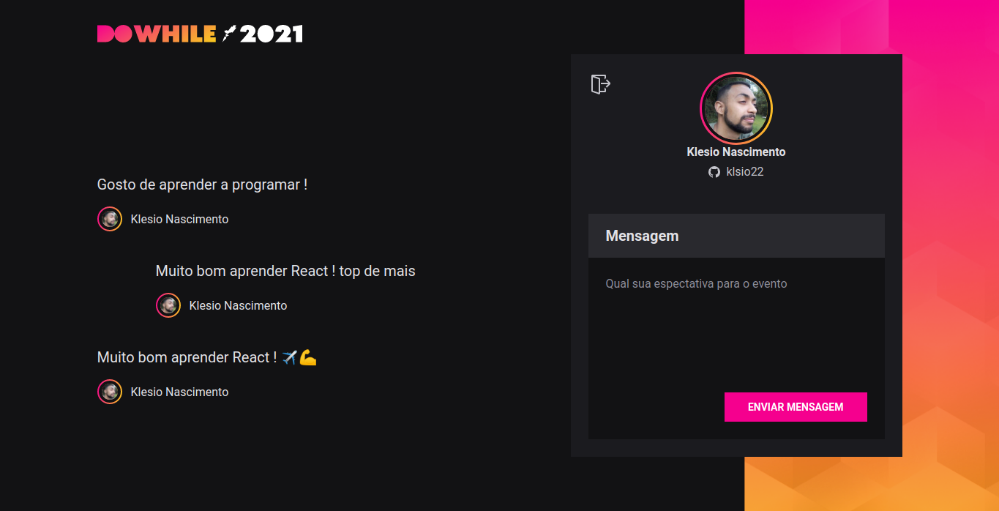

<h1 align="center">
  
</h1>

  <a href="#-tecnologias">Tecnologias</a>&nbsp;&nbsp;&nbsp;|&nbsp;&nbsp;&nbsp;
  <a href="#-projeto">Projeto</a>&nbsp;&nbsp;&nbsp;|&nbsp;&nbsp;&nbsp;
  <a href="#-layout">Layout</a>&nbsp;&nbsp;&nbsp;|&nbsp;&nbsp;&nbsp;
  <a href="#memo-licença">Licença</a>

 
  

  
	

   

## 🚀 Tecnologias

Esse projeto foi desenvolvido com as seguintes tecnologias:

- Node
- React
- Prisma
- TypeScript
- Vite
- SQLite

## 💻 Projeto

✈️O objetivo dessa aplicação web é desenvolver um app que faz a autenticação em tempo real do usuário que possui uma conta no gitHub, para que o usuário possa enviar suas mensagens do que ele/ela espera do evento, e mesmo após a sua saída do login da página do evento suas mensagens continuam visíveis.

## 🔖 Layout

Você pode visualizar o layout do projeto através [desse link](https://www.figma.com/file/PU2K83MQf25jpMNZAaEUj9/%5BNLW-Heat---Mission%3A-Impulse%5D-DoWhile2021-(Community)?node-id=61336%3A1528). É necessário ter conta no [Figma](https://figma.com) para acessá-lo.

## :memo: Licença

Esse projeto está sob a licença MIT. Veja o arquivo [LICENSE](LICENSE.md) para mais detalhes.

##  📜 Como executar

> Obs.: Nesse projeto temos autenticação via OAuth com o GitHub

#### No back-end sigua os seguindes passos :

- Clone o repositório e acesse a pasta **nlw-heat-node**;
- Faça uma copia do arquivo `.env.example` para `.env` e preencha com as suas credenciais do GitHub, esse arquivo .env fica na pasta padrão do projeto **nlw-heat-node**;
- Instale as dependências com `yarn`;
- Executa as migrations com `yarn prisma migrate dev`;
- Inicie o servidor com `yarn dev`;

A aplicação pode ser acessada em [`localhost:4001`](http://localhost:4001/) no back-end.

#### No Front-end sigua os seguindes passos :

- Instale as dependências com `yarn`;

- Inicie o servidor com `yarn dev`;

  A aplicação pode ser acessada em [`localhost:3000`](http://localhost:3000) no back-end.

#### Documentação de pacotes usados durante o projeto no notion:

🌍 [Documentação NLW-Heat](https://www.notion.so/Documenta-o-NLW-Heat-020d835e28c14bb7bcf420744ddd2340)

-----

💪✍️ Projeto desenvolvido acompanhando o evento da Rocketset **NLW/Heat** junto a comunidade da Rocketset no [discord](http://starter-bot.rocketseat.dev/api/discord/login?param=YmFiZDBlNTQtNjBjZi00OWFhLWI3ZjAtYjhhOTYzYzE0MmY4) .💪✍️

